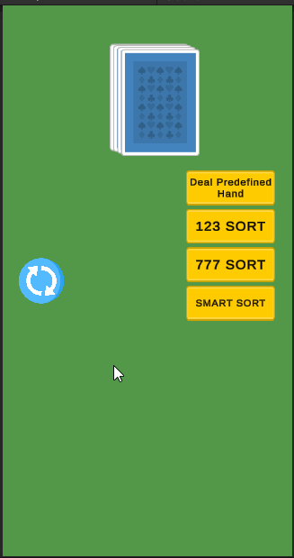

## Card Sorting Case study
Card sorting demo project that displays and animates dealing of cards using custom build Tween library. Cards in hand can be sorted using subsequent 123 sorting, same value 777 sorting, and smart sorting that combines both algorithms and outputs cards sorted in most optimal way. In this demo most optimal way is having most number of points in sorted cards.

### HOW TO USE
When running the application - it will deal you set number of cards. After that you can press one of three buttons that will sort the cards for you. If you are not happy with your hand you can use blue restart button to get a new random hand of cards. **In case you just want to see sorting at work** there is a button that deals 11 predefined cards that have enough cards for different types of sorts.

**NOTE**
When cards are sorted once - they won't come back to hand if you sort cards using different sorting algorithm. Redeal new hand and sort with another algorithm, otherwise cards will overlap old sorted cards

Contents
======

* [Project Setup](#project-setup)
* [Algorithms](#algorithms)
* [Next Improvements](#next-improvements)

### Project Setup

* Game entry point - Preloader.cs. Simply loads game scene. Used to be able to possibly initialize services, add custom splash screen, in fact used for game appearance animation.
* GameManager.cs holds all the logic related to the game flow. On start GameManager call GameStarted event that triggers dealing cards to the player.
* Most of gameplay related settings are decoupled into SettingsSO and CardSettingsSO;
  * **SettingsSO** holds animation data, number of cards dealt, minimum number of cards required for combination
  * **CardSettingsSO** holds an array of card sprites, array of card values (used in smart sorting algorithm), suit order of array of card sprites.
 
* Deck.cs creates cards, has few card related utility methods.
* Hand.cs responsible for holding cards and for controlling what happens when user rearranges the cards in hand by dragging (like in the demo).
* Sorter.cs has all sorting related functions

**How UI Works**
UI buttons call functions in GameManager.cs. those functions are added manually to ease possible changes to the UI (good improvement would be adding separate UI manager).

### Algorithms

1. **SUBSEQUENT SORT**

Separate cards into separate lists by suit. Order every list by card ranks, loop over every list, if the cards are subsequent in rank - add them to list of valid combinations, else continue looping.

2. **SAME VALUE SORT**

Order cards by card rank. loop over sorted cards, for every card - loop over next 3 cards, if they are of the same value - add to combination list, else, select that card as next to check against, skip cards that you've already checked

3. **SMART SORT (SUBSEQUENT + SAME VALUE)** 

Gets all combinations of subsequent and same value sorts, then tries to split previously retrieved combinations into all possible combinations. For every combination loops over the rest of non matching combinations, add every combination to list and check if the total score of combinations in list is <=total cards in hand score. if it is larger - such combinations are invalid - remove the last added card.
While looping-keep track of best combination and its score.
In the end - combination with the highest score will be the most optimal set of combinations for the cards dealt.

### Next Improvements

Overall I am happy with the architecture of the application, but there are few points I would want to improve if I had more time for the development of this application:
1. Rework smart sort algorithm using approach to solving knapsack problem as it would be faster.
2. Change the way I pass cards into sorting algorithm. There is no need to pass CardDisplay, instead I can just pass card rank, its suit and index in the hand.
3. Add more visual effects and score displayment at the end of every sorting.
4. Fix bug where you can't drag cards after they've been sorted into groups. To be able to drag them again you have to redeal new hand.
5. Decouple UI function calls to UI manager and wire up UI with UI managers.

Game Icon credits:
<a href="https://www.flaticon.com/free-icons/playing-card" title="playing card icons">Playing card icons created by Freepik - Flaticon</a>
